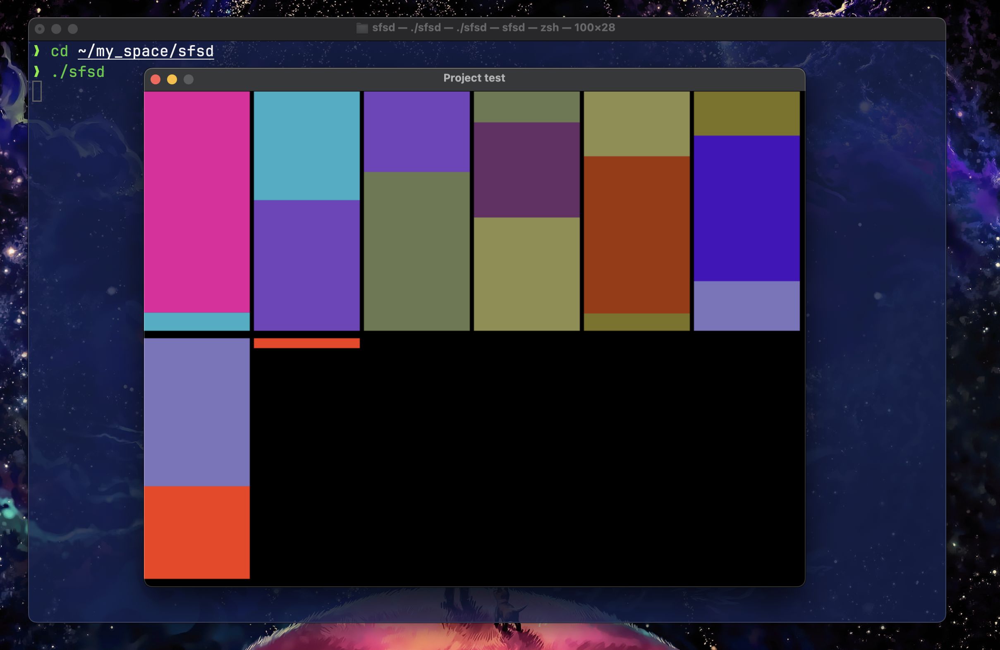
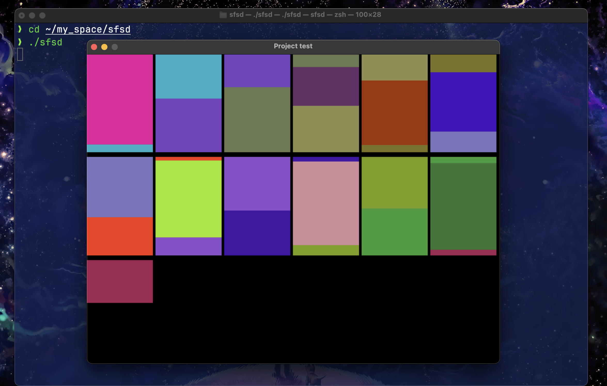
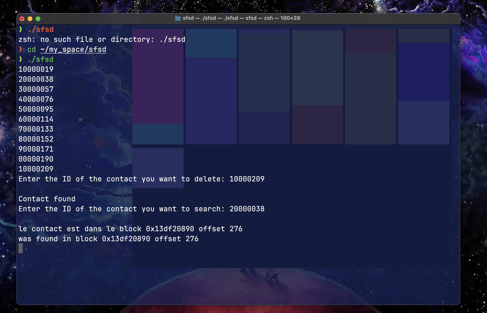

# **Gestion des Contacts**

# **Projet de TP (Rapport):**

1. **Thème:**

Manipulation sur gestion des contacts en langage C. **binôme** **:**

• **Belkacemi Abderrahim –** (Rahim444) 
https://www.linkedin.com/in/belkacemi-abderrahim-80320a184/

• **Aoudia Nour Islam**

1. **Description:**

Notre projet consiste à mettre en œuvre un système de gestion des contacts en utilisant un fichier binaire nommé 'Contacts.bin'. Ce fichier adopte une structure LVC (Organisation chaînée, format variable des enregistrements, et avec chevauchement). Cette approche offre une flexibilité particulière pour gérer efficacement un grand nombre de contacts.

**2.1. Structures de données utilisées:**

• **Contact:** La structure Contact est conçue pour stocker des informations sur un contact, comprenant un identifiant (iD), un nom (name), un numéro de téléphone (phoneNumber), une adresse e-mail (email), et la possibilité d'inclure des informations supplémentaires de longueur variable (otherInfo). Chaque champ est dimensionné pour accommoder la taille maximale prévue, avec des marges pour les caractères de fin de chaîne. L'utilisation d'un pointeur pour otherInfo suggère une gestion dynamique de la mémoire pour stocker des détails supplémentaires.

• **Block** :\*\*La structure Block est destinée à organiser et stocker des contacts de manière efficace. Chaque bloc est identifié par un numéro (blockNumber) et conserve une trace de l'espace occupé en caractères (ocupiedSpace). Un tableau de caractères nommé Contacts est utilisé pour stocker les contacts, bien que la taille spécifique ne soit pas précisée. Un pointeur vers le prochain bloc (nextBlock) permet de créer une liste chaînée de blocs, facilitant la gestion dynamique de la mémoire pour stocker un grand nombre de contacts de manière optimale.

• **FileInfo:** La structure FileInfo gère de manière centralisée une séquence de blocs, probablement organisés en liste chaînée pour stocker des contacts. Les principaux éléments incluent un pointeur vers le premier bloc (firstBlock), le nombre total de blocs dans la séquence (totalSize), le nombre total de contacts stockés (contactSize), ainsi que des statistiques sur les opérations effectuées, telles que le nombre de contacts ajoutés (addedConctacts) et le nombre de contacts supprimés (deletedContacts).

• **IndexFile:** La structure IndexFile est conçue pour indexer des blocs de données dans un fichier. Chaque élément d'index est associé à un identifiant de fichier (id), un pointeur vers le bloc correspondant (Pblock), et un décalage à l'intérieur du bloc (offset). La liste chaînée (next) permet une gestion dynamique des éléments d'index, facilitant ainsi l'organisation flexible de plusieurs entrées d'index dans une structure de fichiers.

**2.2.** **Les différents modules implémentés:**

• **SDL2/SDL.h:** La bibliothèque \<SDL2/SDL.h\> en langage C, connue sous le nom de SDL ( **Simple DirectMedia Layer** ), offre des fonctionnalités puissantes pour le développement multimédia. Elle permet la création de fenêtres graphiques, la gestion de l'entrée utilisateur, le rendu graphique, la lecture de sons et de musique, ainsi que la gestion du temps et des événements. SDL facilite également le travail avec des threads pour la gestion de tâches concurrentes. L'inclusion de \<SDL2/SDL.h\> dans le code indique l'utilisation de ces fonctionnalités, mais nécessite également la liaison avec la bibliothèque SDL lors de la compilation pour un fonctionnement approprié.

• **String.h:** La bibliothèque \<string.h\> offre des outils essentiels pour travailler avec des chaînes de caractères en langage C, couvrant des opérations telles que la détermination de la longueur, la copie, la concaténation, la comparaison et la division en **"tokens"**. Ces fonctions sont largement utilisées dans le développement d'applications C qui impliquent la manipulation de chaînes de caractères.

**2.3** ** Exemple de test de TP:**

1. **Après l'exécution de programme:**

1. **Insertion Random:** cliquer sur la touche 'M'

1. **Insertion avec des formations de contact:** cliquer sur 'espace'.

1. **Suppression d'un contact:** cliquer sur 'delete'

**Avant:**

**Apres:**

1. **La recherche d'un contact :** cliquer sur 'R'

1. **Fichier de contact:**

1. **Fichier de contacts triée:**

1. **Fichier de table d'index (dense):**

1. **Fichier table d'index (non dense):**

